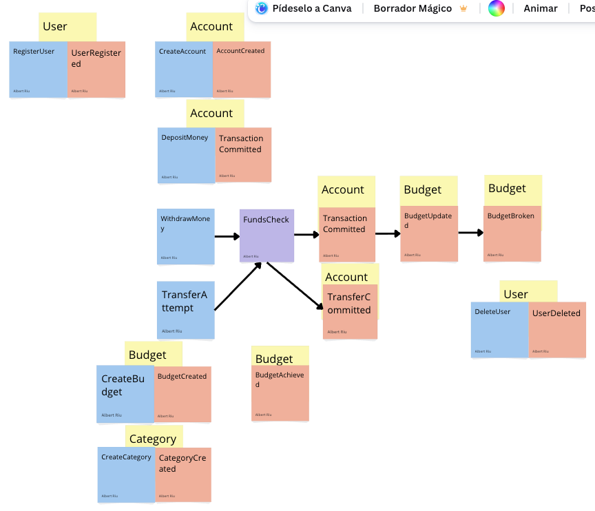
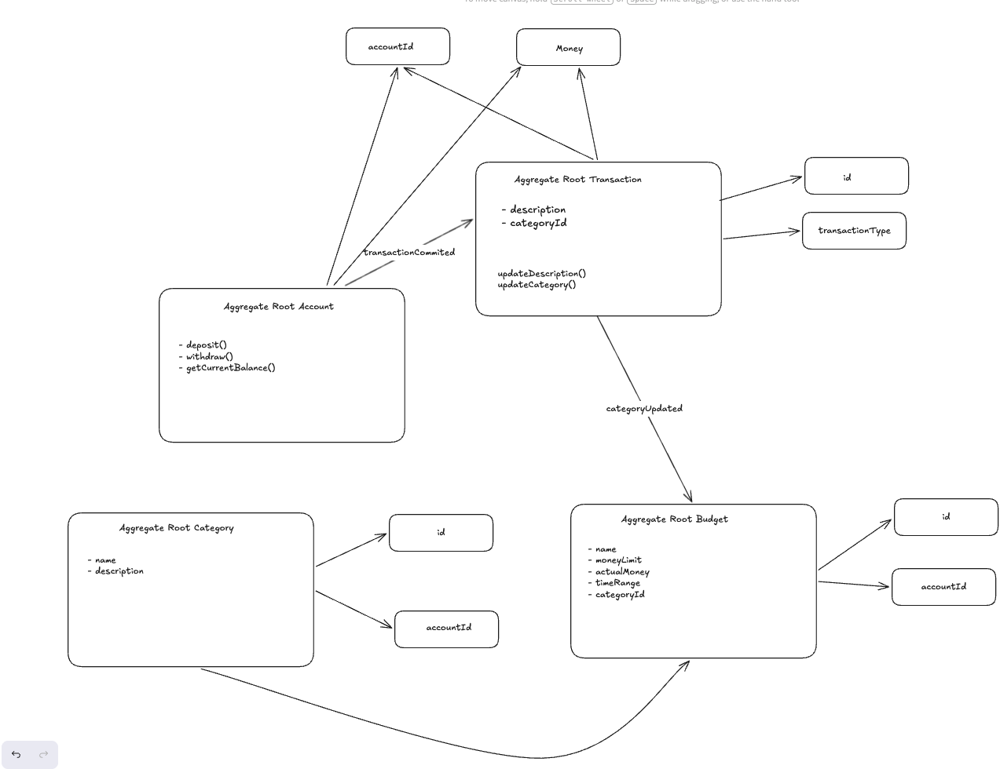

# Expense Tracker



A Python-based domain-driven expense tracker built to manage personal finances with clean design and test coverage.

## Table of Contents
- [Overview](#overview)
- [Key Features](#key-features)
- [Architecture](#architecture)
- [Project Structure](#project-structure)
- [Setup](#setup)
- [Running Tests](#running-tests)
- [Current Status](#current-status)
- [Technology Stack](#technology-stack)
- [Roadmap](#roadmap)

## Overview

Expense Tracker is designed for simple and extensible personal finance management. It currently implements:
- User identity and account modeling 
- Transaction creation and validation (income and expense)
- Value object-based domain rules (Money, Email, Password, etc.)



The project follows Domain-Driven Design (DDD) patterns: entities, value objects, aggregates, and factory methods.

## Key Features

- Secure user identity model with email and password value objects
- Transaction domain entity with strict rules by transaction type
- Monetary value object enforcing currency format and non-negative amounts
- Domain validation at construction time
- Unit tests for core domain logic

## Architecture

The code base follows DDD and separation of concerns:

- `src/identity/` - identity domain models and value objects
- `src/accounting/` - accounting domain models (transactions, budget placeholders)
- `src/` top-level package for shared app structure
- `tests/` - unit tests for domain invariants

### Bounded contexts
- **Identity**: user, credentials, validation 
- **Accounting**: transactions, budgets, money semantics

## Project Structure

```
expenseTracker/
├── README.md
├── requirements.txt
├── src/
│   ├── accounting/
│   │   ├── domain/
│   │   │   ├── entities/
│   │   │   │   └── transaction.py
│   │   │   ├── value_objects/
│   │   │   │   ├── money.py
│   │   │   │   └── transactionType.py
│   │   │   └── events.py
│   ├── identity/
│   │   ├── domain/
│   │   │   ├── entities/
│   │   │   │   └── customer.py
│   │   │   └── value_objects/
│   │   │       ├── email.py
│   │   │       ├── password.py
│   │   │       └── userId.py
│   └── infrastructure/
└── tests/
    └── accounting/
        └── test_all.py
```

## Setup

### Prerequisites
- Python 3.8+
- pip

### Install

```bash
git clone https://github.com/<your-org>/expenseTracker.git
cd expenseTracker
python -m venv venv
source venv/bin/activate
pip install -r requirements.txt
```

## Running Tests

```bash
pytest
```

For verbose output:

```bash
pytest -v
```

## Current Status

### ✅ Implemented
- `identity/domain`: `Customer`, `Email`, `Password`, `UserId`
- `accounting/domain`: `Transaction`, `Money`, `TransactionType`, domain validation rules
- Unit tests for transaction and money invariants

### 🚧 Work in progress
- Budget entity and rules
- Account aggregate root and behaviors
- API layer (FastAPI not yet implemented)
- Repository/persistence infrastructure

## Technology Stack

- Python 3.8+
- pytest
- dataclasses
- `decimal`, `uuid`, `datetime`

## Roadmap

- Add `Account` aggregate and account/transaction lifecycle operations
- Add `Budget` entity and budget category limits
- Add FastAPI REST endpoints
- Implement persistence layer (PostgreSQL recommended)
- Add authentication (hashing + JWT)
- Add integration and acceptance tests

---

> Images above are preserved in the README and are not deleted during this update.
